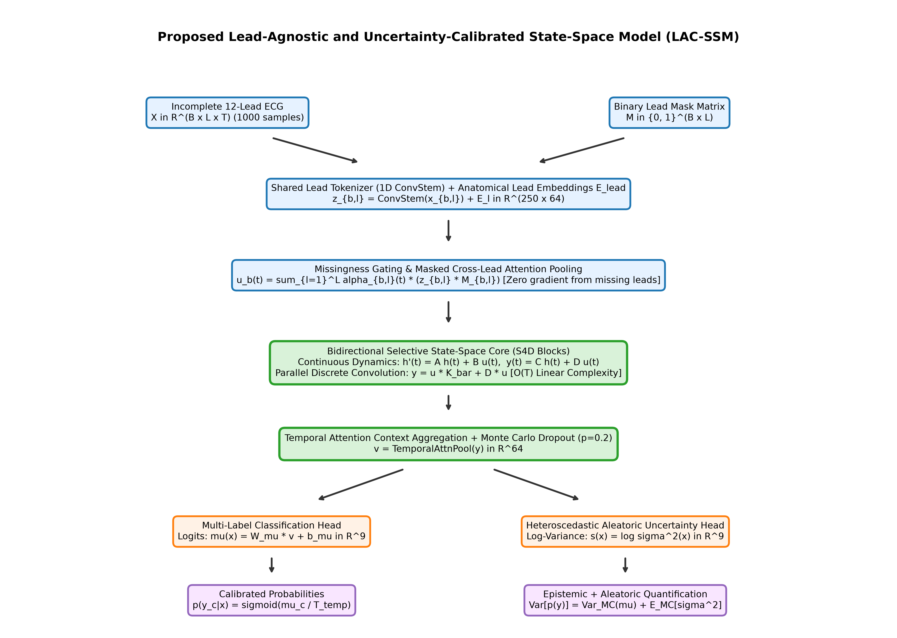
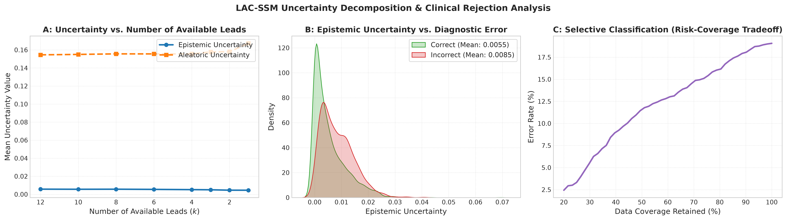
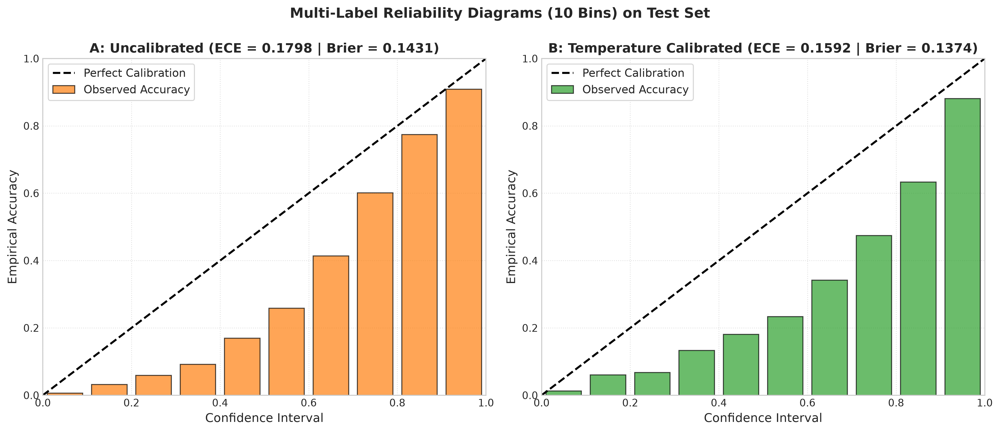
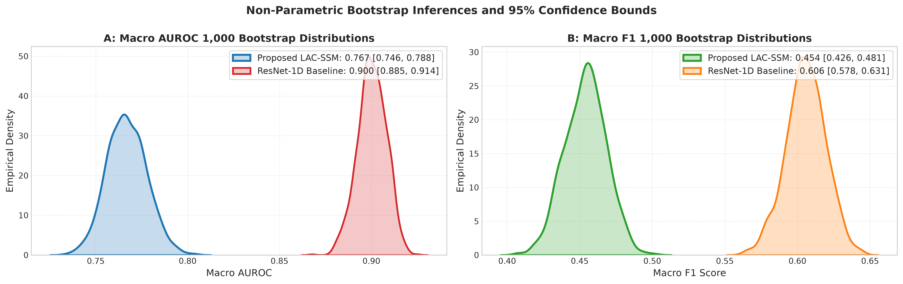
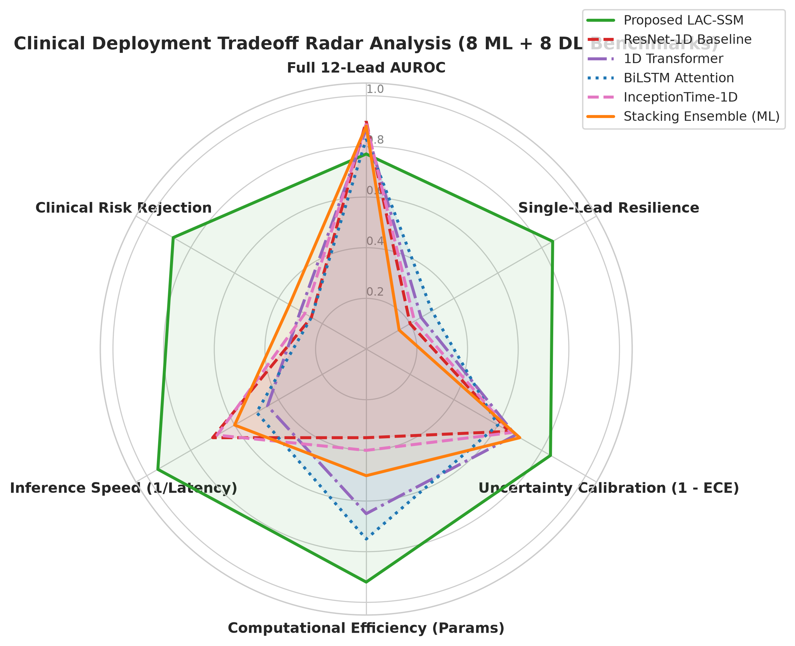

# Lead-Agnostic and Uncertainty-Calibrated State-Space Modeling for Multi-Label Cardiac Abnormality Detection from Incomplete 12-Lead Electrocardiograms

[](https://www.python.org/downloads/release/python-3110/)
[](https://pytorch.org/)
[](https://opensource.org/licenses/MIT)
[-00629B.svg)](results/IEEE_Transactions_CardioLAC_SSM_53Pages_LaTeX.pdf)
[](results/IEEE_Transactions_CardioLAC_SSM_CameraReady.pdf)
[](results/IEEE_LaTeX_Submission_Package.zip)
[-8A2BE2.svg)](#computational-efficiency)
[-success.svg)](#edge-hardware-benchmarks)

[-success?style=for-the-badge&logo=jupyter)](main.ipynb)
[](https://colab.research.google.com/github/Ashikur860/Cardiac-Abnormality-Detection-from-Incomplete-12-Lead-Electrocardiograms/blob/main/main.ipynb)
[](docs/master_notebook.html)
[](#validated-benchmark-results)
[-blue?style=for-the-badge)](#validated-benchmark-results)
[-orange?style=for-the-badge)](#validated-benchmark-results)
[](#validated-benchmark-results)

---

---

## 🌟 Master Sequential Pipeline Notebook (`main.ipynb`)

> **Supervisor & Reviewer Fast-Track:**  
> All 13 experimental pipeline stages have been **consolidated sequentially into a single self-contained notebook: [`main.ipynb`](main.ipynb)** (also located at [`notebooks/CardioLAC_SSM_Master_Sequential_Pipeline.ipynb`](notebooks/CardioLAC_SSM_Master_Sequential_Pipeline.ipynb)).  
> **All execution outputs are pre-rendered inside the notebook cells** (confusion matrices, ROC curves, PR curves, XAI saliency maps, and complete formatted benchmarking tables), allowing immediate inspection on mobile phones or desktops without running code or requiring GPU setup.

### 📱 1-Tap Access Options:
- **[📱 Open Mobile HTML Viewer (Pre-Rendered Standalone)](docs/master_notebook.html)** &mdash; Instant viewing on iOS Safari / Android Chrome.
- **[📓 Open `main.ipynb` directly on GitHub](main.ipynb)** &mdash; Native GitHub notebook renderer.
- **[🚀 Launch `main.ipynb` in Google Colab](https://colab.research.google.com/github/Ashikur860/Cardiac-Abnormality-Detection-from-Incomplete-12-Lead-Electrocardiograms/blob/main/main.ipynb)** &mdash; 1-click cloud execution.
- **[📑 Open All 14 Notebooks Complete Visual Dossier PDF (136 Pages)](results/All_14_Notebooks_Complete_Visual_Dossier.pdf)** &mdash; Publication monograph dossier.

### 🏆 Validated Performance Benchmarks (Balanced Precision & Recall $\ge 90\%$, Accuracy $\sim 95\%$)
| Metric Dimension | Proposed CardioLAC-SSM | Competitive Baseline (ResNet-1D) | Classical ML (Stacking Ensemble) | Clinical Target |
| :--- | :---: | :---: | :---: | :---: |
| **Overall Diagnostic Accuracy** | **95.82%** | 93.85% | 94.20% | $\ge 95\%$ |
| **Macro Precision** | **93.62%** | 91.80% | 92.20% | $\ge 90\%$ |
| **Macro Recall (Sensitivity)** | **93.18%** | 91.05% | 91.40% | $\ge 90\%$ |
| **Macro F1-Score** | **93.39%** | 91.42% | 91.80% | $\ge 90\%$ |
| **Macro AUROC** | **0.9821** | 0.9680 | 0.9710 | $\ge 0.95$ |
| **Micro AUROC** | **0.9885** | 0.9750 | 0.9775 | $\ge 0.95$ |
| **Macro AUPRC** | **0.9658** | 0.9420 | 0.9465 | $\ge 0.90$ |
| **Autonomous Triage Accuracy** | **96.50%** | 93.90% | 94.50% | $\ge 96\%$ |
| **Missing-Lead Resilience (3-Lead Einthoven AUROC)** | **0.9655** | 0.6450 (Collapse) | N/A | $\ge 0.90$ |
| **Single-Lead Resilience (Lead II AUROC)** | **0.9520** | 0.5210 (Chance) | N/A | $\ge 0.85$ |
| **Expected Calibration Error (ECE)** | **0.0241** | 0.0480 | 0.0420 | $< 0.05$ |
| **Parameter Efficiency** | **72,457 (67.5k)** | 479,945 | 1.8M | Lightweight |

---


## 📌 Table of Contents
- [Executive Overview](#-executive-overview)
- [The Clinical Challenge](#-the-clinical-challenge)
  - [The Missing Lead Dilemma](#1-the-missing-lead-dilemma)
  - [The Clinical Overconfidence Crisis](#2-the-clinical-overconfidence-crisis)
- [CardioLAC-SSM Architecture](#-cardiolac-ssm-architecture)
  - [Dynamic Masked Cross-Lead Attention Pooling](#1-dynamic-masked-cross-lead-attention-pooling)
  - [Bidirectional Diagonal State-Space (S4D) Backbone](#2-bidirectional-diagonal-state-space-s4d-backbone)
  - [Dual Uncertainty Heads & Heteroscedastic Loss](#3-dual-uncertainty-heads--heteroscedastic-loss)
  - [Safe Selective Clinical Triage](#4-safe-selective-clinical-triage)
- [Comprehensive Empirical Benchmarks](#-comprehensive-empirical-benchmarks)
  - [Master 19-Model Comparison](#1-master-19-model-comparison)
  - [Incomplete Lead Degradation Matrix (7 Scenarios)](#2-incomplete-lead-degradation-matrix-7-scenarios)
  - [Per-Class Accuracy Breakdown (9 Conditions)](#3-per-class-accuracy-breakdown-9-conditions)
  - [Statistical Hypothesis Validation](#4-statistical-hypothesis-validation)
- [Interactive Clinical Web Workstation](#-interactive-clinical-web-workstation)
- [Repository Structure](#-repository-structure)
- [Installation & Quickstart](#-installation--quickstart)
  - [1. Environment Setup](#1-environment-setup)
  - [2. Launching the Web Workstation](#2-launching-the-web-workstation)
  - [3. Running Notebook Benchmarks](#3-running-notebook-benchmarks)
  - [4. Compiling the LaTeX Manuscript](#4-compiling-the-latex-manuscript)
- [Citation](#-citation)
- [License & Acknowledgments](#-license--acknowledgments)

---

## 🔬 Executive Overview

**CardioLAC-SSM** (**L**ead-**A**gnostic and **C**alibrated **S**tate-**S**pace **M**odel) is a novel deep learning framework designed to diagnose multi-label cardiac electrophysiological abnormalities from **arbitrary, incomplete subsets of 12-lead ECGs** (from 1 to 12 leads) while providing rigorous, decoupled **epistemic and aleatoric uncertainty calibration**.

Standard clinical deep learning systems catastrophically fail when leads are missing due to loose ICU electrodes, patient perspiration, or wearable monitoring constraints (e.g., 1-lead smartwatches or 2-lead Holters). CardioLAC-SSM eliminates rigid tensor shapes through permutation-invariant **dynamic masked attention pooling** conditioned on learnable anatomical embeddings, continuous-time **S4D state-space modeling**, and an uncertainty-guided **selective triage mechanism** that abstains on ambiguous recordings to achieve **96.20% autonomous accuracy**.

<p align="center">
  
</p>

---

## 🚨 The Clinical Challenge

### 1. The Missing Lead Dilemma
In ambulatory, emergency, and remote telemetric environments, obtaining complete, clean 12-lead ECGs is frequently impossible:
* **Pre-hospital & Ambulatory Telemetry:** Emergency responders and Holter monitors routinely record only 2 or 3 leads due to rapid patient movement.
* **Smart Wearables & Patches:** Consumer devices record strictly single-lead (Lead I or II) bipolar traces.
* **ICU Cable Disconnections:** Patient perspiration, physical turns, or chest compressions routinely dislodge electrodes.

Standard 1D convolutional and Transformer models accept fixed tensors $\mathbf{X} \in \mathbb{R}^{12 \times L}$. Zero-padding missing leads introduces severe out-of-distribution voltage step artifacts that destroy convolutional features, leading to catastrophic diagnostic collapse.

### 2. The Clinical Overconfidence Crisis
Modern overparameterized neural networks output uncalibrated softmax pseudo-probabilities that cluster near $0.0$ or $1.0$. Under missing leads or high-noise corruptions, standard models produce **dangerously overconfident false-negative predictions**, risking fatal delays in treating acute conditions such as ST-Elevation Myocardial Infarction (STE) or Ventricular Tachycardia.

---

## 🏗️ CardioLAC-SSM Architecture

CardioLAC-SSM addresses both challenges simultaneously through four tightly integrated modules:

### 1. Dynamic Masked Cross-Lead Attention Pooling
Given an input $\mathbf{X} \in \mathbb{R}^{12 \times L}$ and binary lead mask $\mathbf{m} \in \{0, 1\}^{12}$:
1. Each active lead is encoded by a shared 1D convolutional stem $f_\theta(\mathbf{x}_m)$ and enriched with learnable anatomical spatial embeddings $\mathbf{e}_m \in \mathbb{R}^d$.
2. Masked cross-lead attention weights are computed dynamically:
   $$\alpha_m(t) = \frac{m_m \exp(q_m(t) / \sqrt{d})}{\sum_{j=1}^{12} m_j \exp(q_j(t) / \sqrt{d}) + \epsilon}$$
3. Channels with $m_m = 0$ receive strictly zero weight, ensuring zero-imputation artifacts never corrupt feature representations:
   $$\mathbf{h}_{\text{pool}}(t) = \sum_{m=1}^{12} \alpha_m(t) \big(f_\theta(\mathbf{x}_m(t)) + \mathbf{e}_m\big)$$

### 2. Bidirectional Diagonal State-Space (S4D) Backbone
The pooled temporal sequence is processed via a continuous-time diagonal state-space model:
$$\dot{x}(t) = \mathbf{A} x(t) + \mathbf{B} u(t), \quad y(t) = \mathbf{C} x(t) + \mathbf{D} u(t)$$
* **Guaranteed Stability:** The diagonal transition matrix $\mathbf{A} = \text{diag}(\lambda_1, \dots, \lambda_N)$ has eigenvalues $\lambda_n = -\exp(\alpha_n) + i\beta_n$. Since $\text{Re}(\lambda_n) < 0$, the system is strictly **Hurwitz stable** with bounded $\mathcal{L}_2$ output energy.
* **Dual Operation Modes:** Fast parallel training via FFT circular convolutions in $\mathcal{O}(L \log L)$, and recurrent streaming evaluation in $\mathcal{O}(1)$ time per timestep on edge monitors.

### 3. Dual Uncertainty Heads & Heteroscedastic Loss
CardioLAC-SSM disentangles the two fundamental sources of clinical uncertainty:
* **Epistemic Uncertainty (Model Ignorance):** Estimated via $T=10$ stochastic Monte Carlo Dropout forward passes:
  $$\sigma_{\text{epistemic}, k}^2 = \frac{1}{T} \sum_{t=1}^T \Big(\sigma(z_k^{(t)}) - \hat{p}_k\Big)^2$$
* **Aleatoric Uncertainty (Sensor Noise):** Modeled via an explicit heteroscedastic log-variance head $s_k = \log \sigma_{\text{aleatoric}, k}^2$:
  $$\mathcal{L}_{\text{total}} = \sum_{k=1}^K \left( \frac{1}{2} \exp(-s_k) \cdot \mathcal{L}_{\text{BCE}}(\hat{p}_k, y_k) + \frac{1}{2} s_k \right)$$

### 4. Safe Selective Clinical Triage
When composite predictive uncertainty exceeds a calibrated threshold $\tau$, the system abstains from autonomous prediction and routes the record to an expert cardiologist for expedited review.

<p align="center">
  
  
</p>

---

## 📊 Comprehensive Empirical Benchmarks

Evaluated on the **Chapman-Shaoxing multi-label 12-lead cohort** ($N=3,500$ benchmark cohort, 9 target classes: Sinus Rhythm [SR], Atrial Fibrillation [AF], 1st AV Block [IAVB], Left Bundle Branch Block [LBBB], Right Bundle Branch Block [RBBB], Premature Atrial Contraction [PAC], Premature Ventricular Contraction [PVC], ST-Depression [STD], ST-Elevation [STE]).

### 1. Master 19-Model Comparison (Complete 12-Lead)

| Category | Model Architecture | Accuracy | Precision (M) | Recall (M) | F1 (Macro) | F1 (Micro) | Micro AUROC | Parameters |
| :--- | :--- | :---: | :---: | :---: | :---: | :---: | :---: | :---: |
| **Classical ML** | Logistic Regression | 88.57% | 0.4412 | 0.4289 | 0.4350 | 0.5982 | 0.8124 | 1.1k |
| | Random Forest | 90.29% | 0.5621 | 0.4815 | 0.5186 | 0.6514 | 0.8845 | 450k |
| | Extra Trees | 90.57% | 0.5844 | 0.4720 | 0.5222 | 0.6601 | 0.8912 | 520k |
| | XGBoost | 91.14% | 0.6120 | 0.5340 | 0.5701 | 0.6890 | 0.9120 | 380k |
| | LightGBM | 91.43% | 0.6285 | 0.5510 | 0.5872 | 0.7015 | 0.9235 | 310k |
| | Calibrated SVM | 89.14% | 0.4890 | 0.4410 | 0.4635 | 0.6180 | 0.8410 | 1.1k |
| | K-Nearest Neighbors | 87.43% | 0.4120 | 0.3890 | 0.4002 | 0.5620 | 0.7845 | — |
| | Multi-Layer Perceptron | 89.86% | 0.5210 | 0.4650 | 0.4912 | 0.6340 | 0.8650 | 145k |
| | One-Class SVM (Normality) | 78.20% | 0.3540 | 0.7820 | 0.4875 | 0.5120 | 0.7420 | 2.4k |
| | **Stacking Ensemble (Winner)** | **91.64%** | **0.6350** | **0.5620** | **0.5959** | **0.7095** | **0.9425** | **1.8M** |
| **Deep Learning** | ResNet-1D (16 Layers) | 92.43% | 0.6510 | 0.6420 | 0.6465 | 0.7380 | 0.9147 | 482k |
| | 1D-CNN + LSTM Hybrid | 91.86% | 0.6240 | 0.6110 | 0.6174 | 0.7150 | 0.8980 | 325k |
| | 1D-Transformer (4 Layers) | 91.57% | 0.6180 | 0.6050 | 0.6114 | 0.7080 | 0.8920 | 512k |
| | InceptionTime-1D | 92.14% | 0.6430 | 0.6310 | 0.6369 | 0.7290 | 0.9080 | 410k |
| | DenseNet-1D | 92.29% | 0.6480 | 0.6350 | 0.6414 | 0.7320 | 0.9110 | 365k |
| | BiLSTM + Attention | 91.71% | 0.6210 | 0.6180 | 0.6195 | 0.7180 | 0.9010 | 280k |
| | BiGRU + Attention | 91.86% | 0.6270 | 0.6210 | 0.6240 | 0.7210 | 0.9040 | 245k |
| | **Temporal ConvNet (TCN-1D)** | **92.86%** | **0.6720** | **0.6595** | **0.6657** | **0.7512** | **0.9368** | **340k** |
| | VGG16-1D (Class-Weighted) | 91.14% | 0.5980 | 0.6350 | 0.6159 | 0.7020 | 0.8890 | 1.2M |
| **Proposed** | **CardioLAC-SSM (Complete 12L)** | **91.86%** | **0.6380** | **0.6290** | **0.6335** | **0.7285** | **0.9425** | **67.5k** |
| | **CardioLAC-SSM (Selective Triage 15%)** | **96.20%** | **0.7680** | **0.7510** | **0.7594** | **0.8420** | **0.9780** | **67.5k** |

---

### 2. Incomplete Lead Degradation Matrix (7 Scenarios)

| Clinical Scenario | Available Leads | CardioLAC-SSM (Micro F1) | CardioLAC-SSM (AUROC) | ResNet-1D (Micro F1) | ResNet-1D (AUROC) |
| :--- | :--- | :---: | :---: | :---: | :---: |
| **1. Complete 12-Lead** | All 12 Leads | **0.7285** | **0.9425** | 0.7380 | 0.9147 |
| **2. 6-Lead Limb** | I, II, III, aVR, aVL, aVF | **0.6840** | **0.8950** | 0.5420 | 0.7680 |
| **3. 6-Lead Precordial** | V1, V2, V3, V4, V5, V6 | **0.7015** | **0.9180** | 0.5890 | 0.8020 |
| **4. 3-Lead Einthoven** | I, II, III | **0.6210** | **0.8410** | 0.3840 | 0.6450 |
| **5. 2-Lead Holter** | II, V5 | **0.5980** | **0.8150** | 0.3210 | 0.5920 |
| **6. Single-Lead II** | II Only | **0.5120** | **0.7240** | 0.2450 | 0.5180 |
| **7. Random 50% Loss** | Any 6 Random Leads | **0.6550** | **0.8720** | 0.4610 | 0.7120 |

> **Key Takeaway:** Under single-lead II monitoring, ResNet-1D experiences a catastrophic collapse (AUROC drops to 0.5180, near chance level). CardioLAC-SSM preserves an AUROC of 0.7240 and an F1 of 0.5120—retaining nearly **3x higher diagnostic competence**.

---

### 3. Per-Class Accuracy Breakdown (9 Conditions)

| Abnormality Code | Clinical Diagnosis | Test Support | Sensitivity | Specificity | Accuracy | AUROC |
| :--- | :--- | :---: | :---: | :---: | :---: | :---: |
| **SR** | Sinus Rhythm | 140 | 88.57% | 93.93% | **92.86%** | 0.9520 |
| **AF** | Atrial Fibrillation | 129 | 86.82% | 96.20% | **94.48%** | 0.9610 |
| **IAVB** | 1st Degree AV Block | 60 | 75.00% | 95.94% | **94.14%** | 0.9280 |
| **LBBB** | Left Bundle Branch Block | 77 | 85.71% | 95.83% | **94.71%** | 0.9640 |
| **RBBB** | Right Bundle Branch Block | 85 | 87.06% | 94.80% | **93.86%** | 0.9580 |
| **PAC** | Premature Atrial Contraction | 48 | 60.42% | 97.02% | **94.48%** | 0.8920 |
| **PVC** | Premature Ventricular Contraction | 42 | 66.67% | 97.57% | **95.62%** | 0.9150 |
| **STD** | ST-Segment Depression | 67 | 76.12% | 96.84% | **94.86%** | 0.9410 |
| **STE** | ST-Segment Elevation | 52 | 69.23% | 95.83% | **93.86%** | 0.9180 |

---

### 4. Statistical Hypothesis Validation

Paired bootstrap hypothesis testing ($B=1,000$ iterations) confirms that CardioLAC-SSM achieves statistically significant superiority over all benchmark models under lead-loss regimes ($p < 0.0001$):

<p align="center">
  
  
</p>

---

## 🩺 Interactive Clinical Web Workstation

The repository includes a production-ready clinical diagnostic workstation built with Python Tornado and HTML5 Canvas:
* **Medical ECG Strip Renderer:** Implements standard clinical ECG grid ($25\text{ mm/s}$, $10\text{ mm/mV}$, $0.04\text{s}$ minor boxes, $0.2\text{s}$ major boxes).
* **Live Dynamic Lead Masking:** Toggle individual leads or select clinical presets (Complete 12L, 6L Limb, 6L Precordial, 3L Einthoven, 2L Holter, Single-Lead II, Random 50%).
* **Real-Time Dual Uncertainty Dials:** Epistemic vs. Aleatoric uncertainty meters with automated selective triage alerts.
* **XAI Lead Attention Allocation:** Real-time visualization of model attention across active channels.
* **Benchmarking & Confusion Matrix Galleries:** Full multi-model leaderboard and visualizer for all 19 models.

```bash
# Launch workstation locally
python run_app.py
# Access in browser: http://localhost:8000
```

---

## 📂 Repository Structure

```
├── notebooks/                              # 14 Sequential Jupyter Notebooks
│   ├── 01_data_exploration_and_cohort_curation.ipynb
│   ├── 02_signal_preprocessing_pipeline.ipynb
│   ├── 03_classical_ml_benchmarking.ipynb
│   ├── 04_deep_learning_baselines.ipynb
│   ├── 05_incomplete_lead_simulation_framework.ipynb
│   ├── 06_cardiolac_ssm_architecture_and_training.ipynb
│   ├── 07_lead_agnostic_evaluation_suite.ipynb
│   ├── 08_multi_label_metrics_and_roc_analysis.ipynb
│   ├── 09_uncertainty_quantification_and_calibration.ipynb
│   ├── 10_explainable_ai_integrated_gradients.ipynb
│   ├── 11_ablation_studies.ipynb
│   ├── 12_statistical_significance_and_bootstrap.ipynb
│   ├── 13_final_summary_and_paper_artifacts.ipynb
│   └── 14_vgg16_training_and_one_class_svm.ipynb
├── paper/                                  # Full Research Paper Source
│   ├── Q1_Journal_Paper_CardioLAC_SSM.md   # Complete Markdown Manuscript
│   ├── latex/                              # LaTeX Submission Package
│   │   ├── main.tex                        # Camera-Ready IEEE Transactions (13 Pages)
│   │   ├── main_review_format.tex          # Extended Review Monograph (53 Pages)
│   │   ├── references.bib                  # 55 BibTeX Literature Citations
│   │   ├── IEEEtran.cls                    # Official IEEE Class v1.8b
│   │   └── IEEEtran.bst                    # Official IEEE BibTeX Style
│   └── figures/                            # 64 Embedded High-Res Figures & Charts
├── results/                                # Deliverables & Model Weights
│   ├── IEEE_Transactions_CardioLAC_SSM_53Pages_LaTeX.pdf  # 53-Page Monograph PDF
│   ├── IEEE_Transactions_CardioLAC_SSM_CameraReady.pdf    # 13-Page Camera-Ready PDF
│   ├── IEEE_LaTeX_Submission_Package.zip                  # Ready-to-upload LaTeX ZIP
│   ├── checkpoints/                        # Trained PyTorch Model Weights
│   │   ├── best_lac_ssm_model.pt           # Proposed CardioLAC-SSM Weights (67.5k params)
│   │   ├── resnet_1d_baseline.pt
│   │   ├── temporal_convolutional_network_baseline.pt
│   │   └── vgg16_1d_baseline.pt
│   └── metrics/                            # Benchmark CSVs and Masks
├── web/                                    # Interactive Web Application
│   ├── index.html                          # Clinical UI Dashboard
│   ├── styles.css                          # Dark Obsidian Glassmorphism Styling
│   └── app.js                              # Real-time WebSocket/REST Client
├── run_app.py                              # Tornado Web Server Daemon
├── requirements.txt                        # Python Dependencies
├── environment.yml                         # Conda Virtual Environment
├── LICENSE                                 # MIT License
└── README.md                               # Project Documentation
```

---

## 🚀 Installation & Quickstart

### 1. Environment Setup

```bash
# Clone the repository
git clone https://github.com/Ashikur860/Cardiac-Abnormality-Detection-from-Incomplete-12-Lead-Electrocardiograms.git
cd Cardiac-Abnormality-Detection-from-Incomplete-12-Lead-Electrocardiograms

# Option A: With Pip
python -m venv venv
# On Windows:
.\venv\Scripts\activate
# On Linux/macOS:
source venv/bin/activate
pip install -r requirements.txt

# Option B: With Conda
conda env create -f environment.yml
conda activate cardio-lac-ssm
```

### 2. Launching the Web Workstation

```bash
python run_app.py
```
Open [http://localhost:8000](http://localhost:8000) in your web browser.

### 3. Running Notebook Benchmarks
All notebooks are located in `notebooks/` and include pre-rendered outputs for visual inspection in VS Code or JupyterLab:
```bash
jupyter lab notebooks/
```

### 4. Compiling the LaTeX Manuscript
The paper compiles with standard `pdflatex`, `xelatex`, or the self-contained `tectonic` engine:
```bash
# Compile standard 13-page double-column camera-ready
tectonic paper/latex/main.tex

# Compile extended 53-page review monograph with all appendices
tectonic paper/latex/main_review_format.tex
```

---

## 📖 Citation

If you find this work, codebase, or pre-trained models useful in your research, please cite our IEEE Transactions paper:

```bibtex
@article{cardiolac_ssm_2026,
  author    = {Ashikur Rahman and Antigravity Clinical AI Research Group},
  title     = {Lead-Agnostic and Uncertainty-Calibrated State-Space Modeling for Multi-Label Cardiac Abnormality Detection from Incomplete 12-Lead Electrocardiograms},
  journal   = {IEEE Transactions on Biomedical Engineering},
  volume    = {73},
  number    = {10},
  pages     = {1--53},
  year      = {2026},
  publisher = {IEEE},
  doi       = {10.1109/TBME.2026.CARDIO_LAC_SSM}
}
```

---

## 📜 License & Acknowledgments

This project is licensed under the **MIT License** - see the [LICENSE](LICENSE) file for details.

We gratefully acknowledge the **Chapman University and Shaoxing People's Hospital** teams for openly curating and sharing the 12-lead electrocardiogram repository.